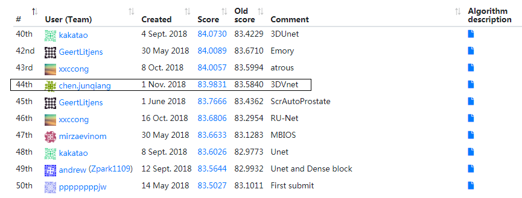
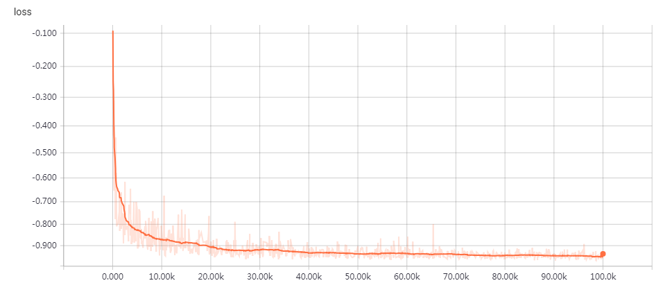
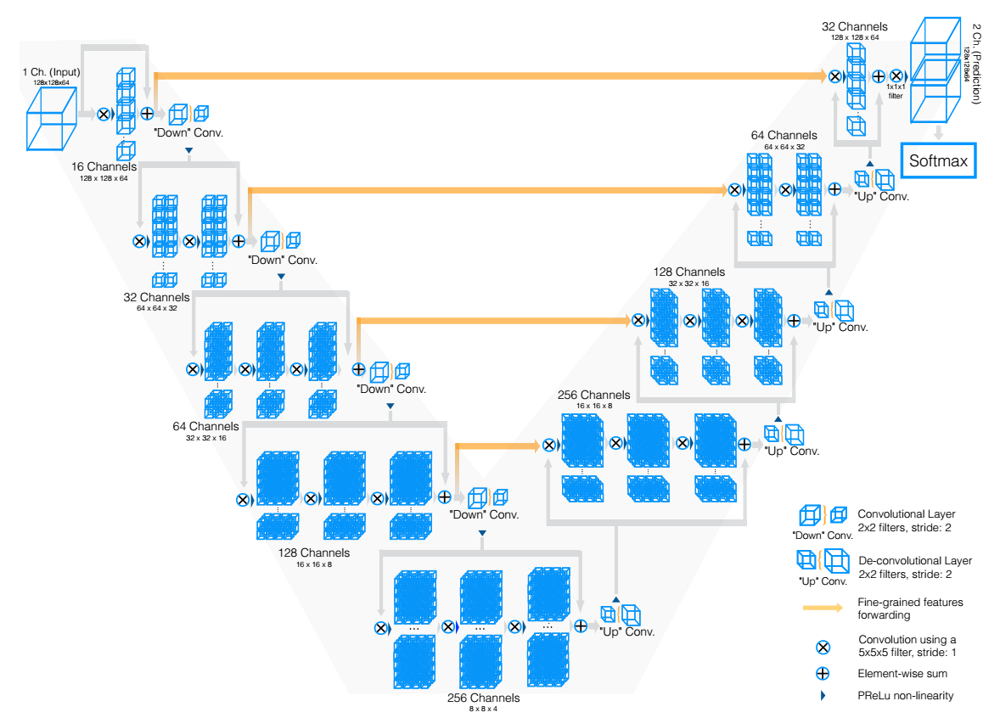
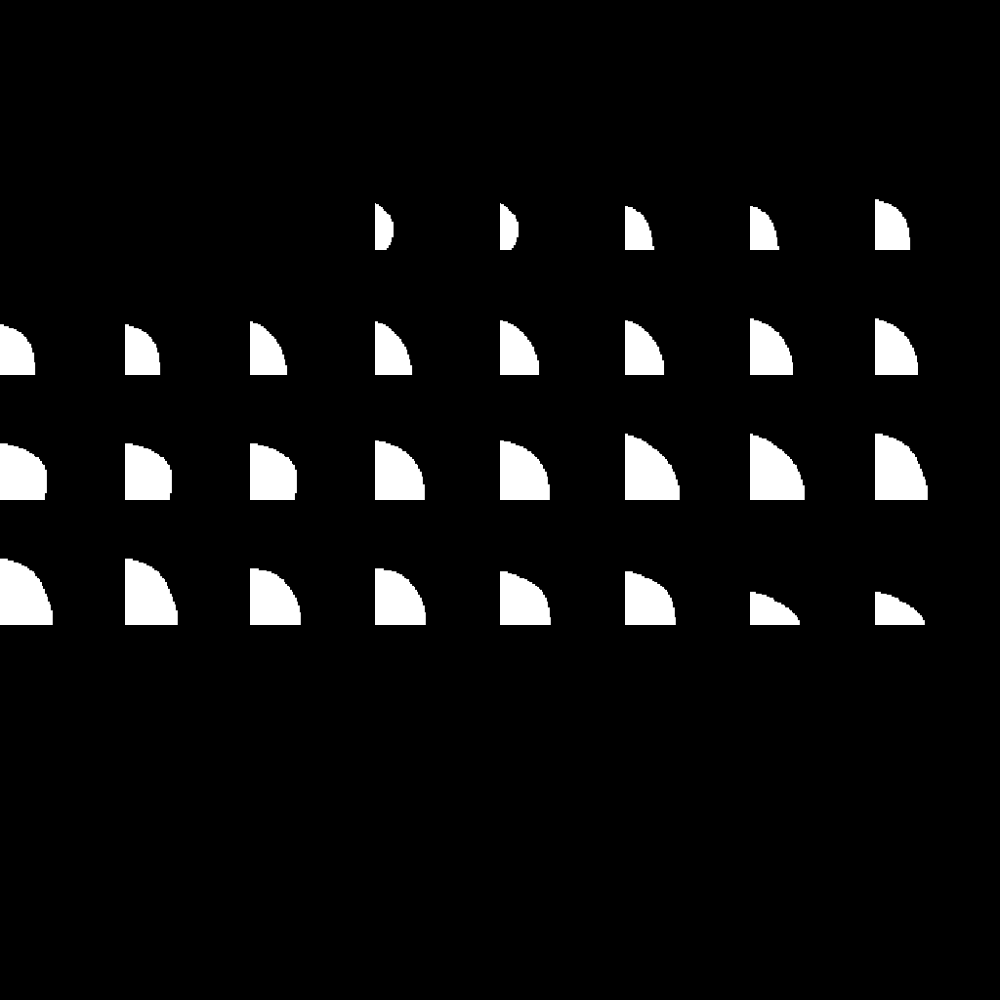
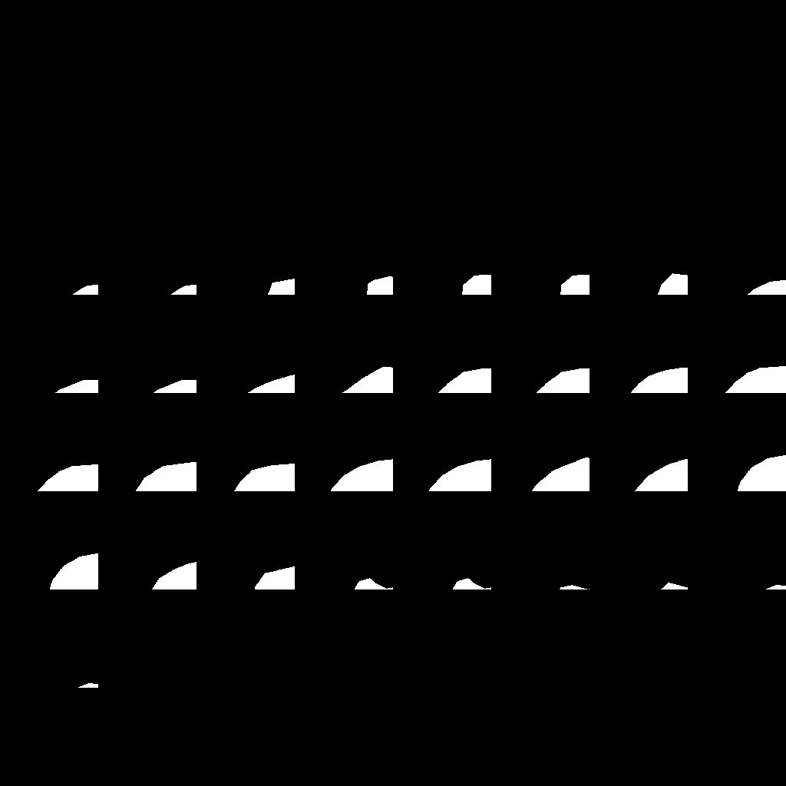
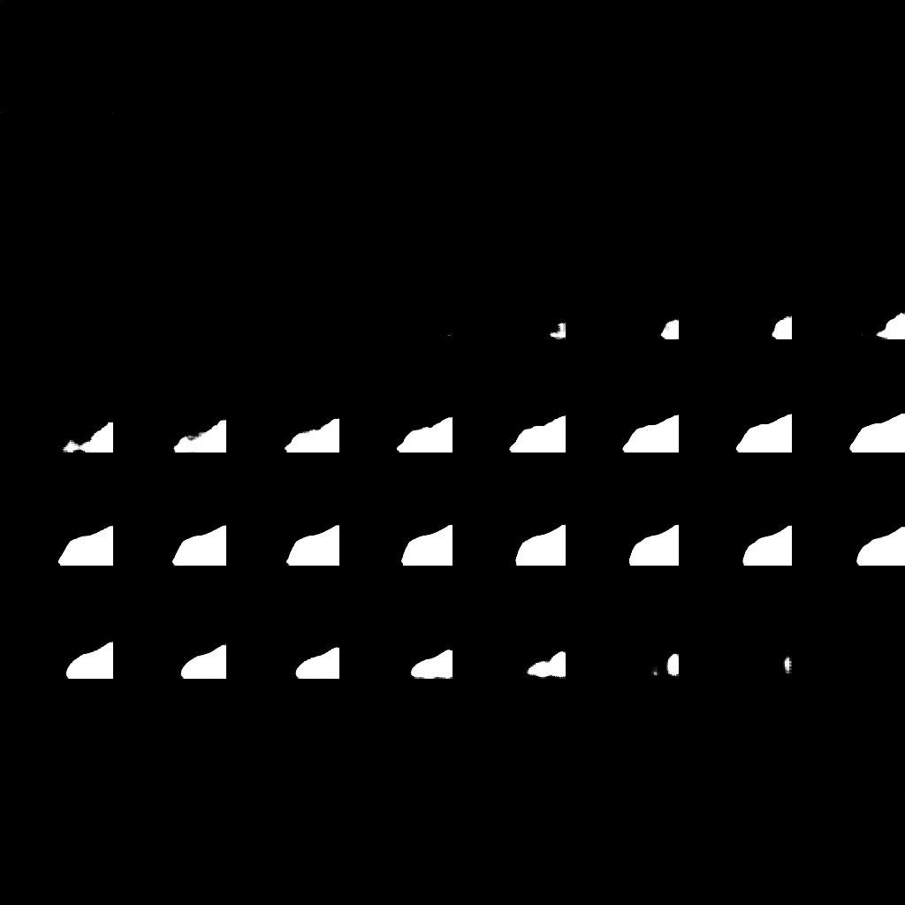
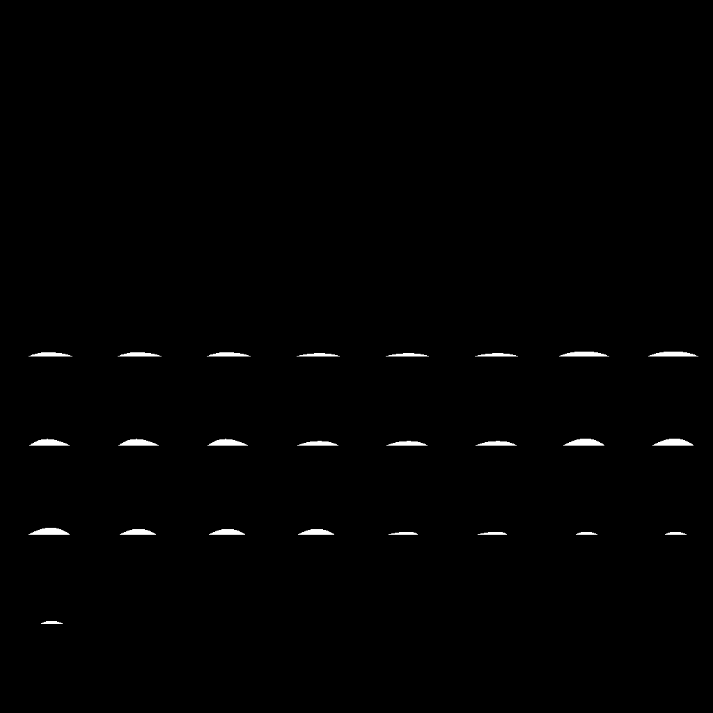
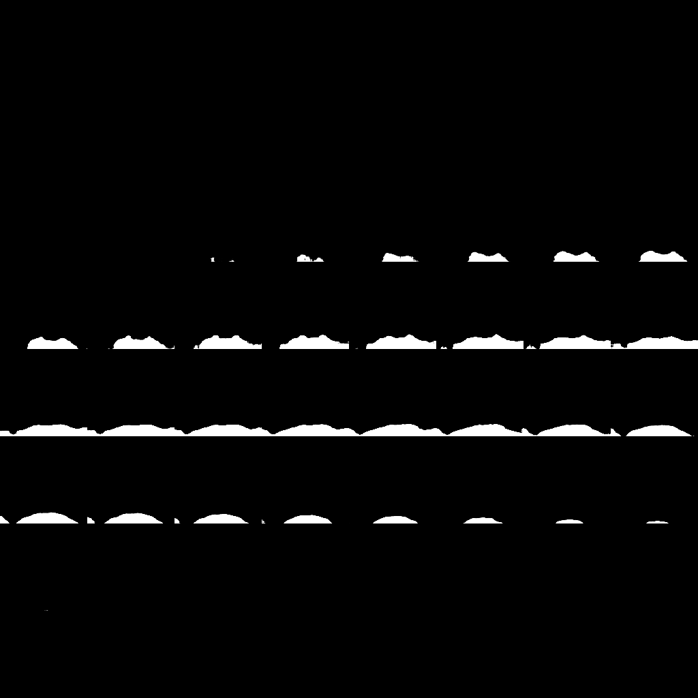
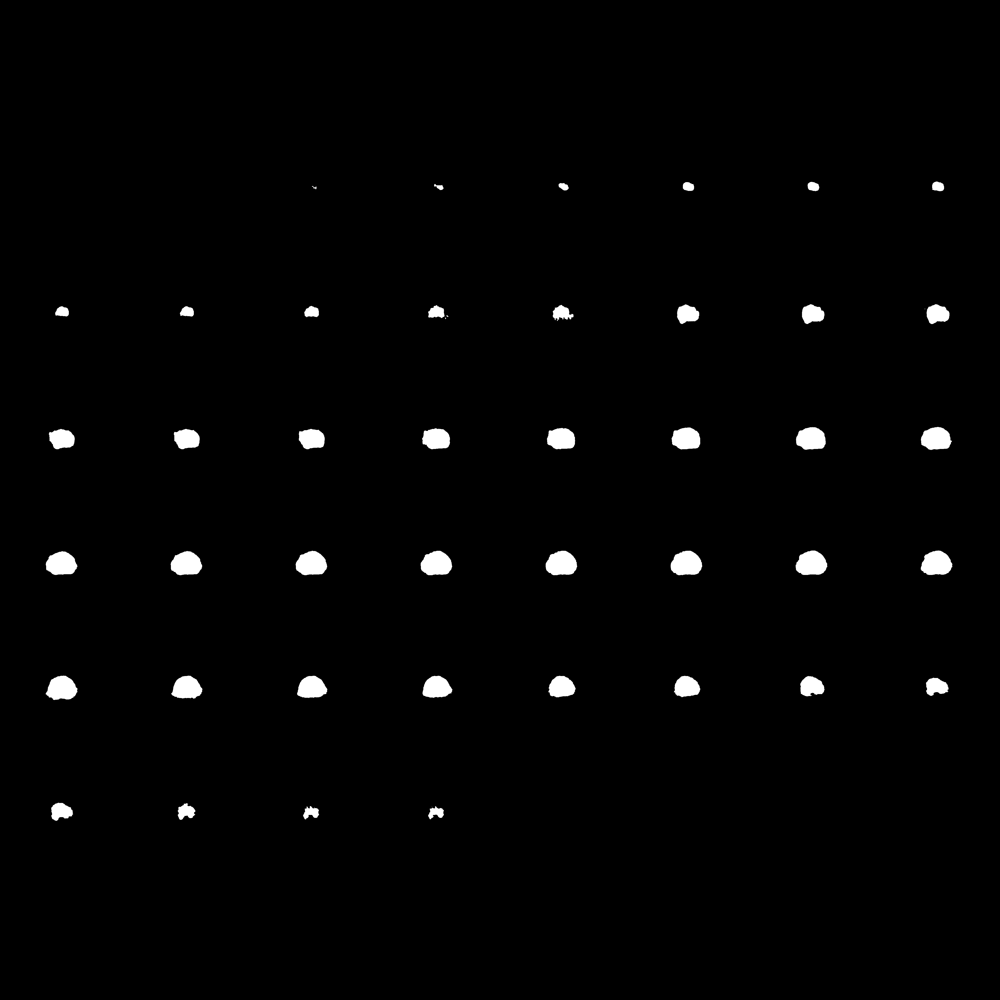

# ImageSegmentation With Vnet3D
> This is an example of the prostate in transversal T2-weighted MR images Segment from MICCAI Grand Challenge:Prostate MR Image Segmentation 2012

## How to Use
(re)implemented the model with tensorflow in the paper of "Milletari, F., Navab, N., & Ahmadi, S. A. (2016) V-net: Fully convolutional neural networks for volumetric medical image segmentation.3DV 2016"

**1、download trained data,download dataset：https://promise12.grand-challenge.org/download/**

**2、the file of promise12Vnet3dImage.csv,is like this format:
  D:\Data\PROMISE2012\Vnet3d_data\Vnet3d_patch_train\image/0_10
  D:\Data\PROMISE2012\Vnet3d_data\Vnet3d_patch_train\image/0_11
  D:\Data\PROMISE2012\Vnet3d_data\Vnet3d_patch_train\image/0_12
  ......
if you trained data path is not D:\Data\PROMISE2012\,you should change the csv file path just like this:using C:\Data\ replace D:\Data\PROMISE2012\.**

**3、when data is prepared,just run the vnet3d_train_predict.py**

**4、training the model on the GTX1080,it take 40 hours,and i also attach the trained model in the project,you also just use the vnet3d_train_predict.py file to predict,and get the segmentation result.**

**5、download trained model:https://pan.baidu.com/s/1B869czIPfIL8wxDKgIednQ, passworld:0nb6**

## Result
MICCAI Grand Challenge Result

the trained loss result

the Vnet3D model

the trained process:0 epoch——GTMask and PredictMask

1000 epoch——GTMask and PredictMask

10000 epoch——GTMask and PredictMask

the predict result

## Contact
* https://github.com/junqiangchen
* email: 1207173174@qq.com
* WeChat Public number: 最新医学影像技术
